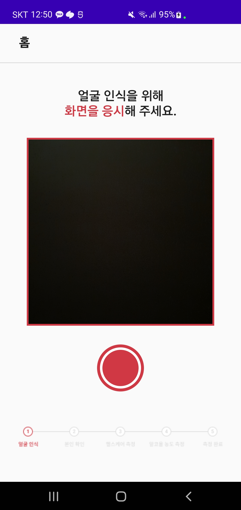
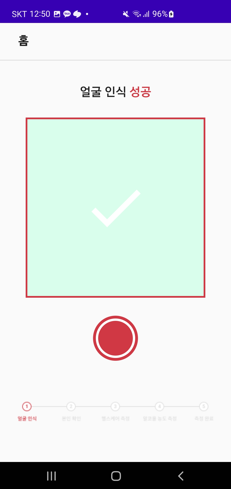
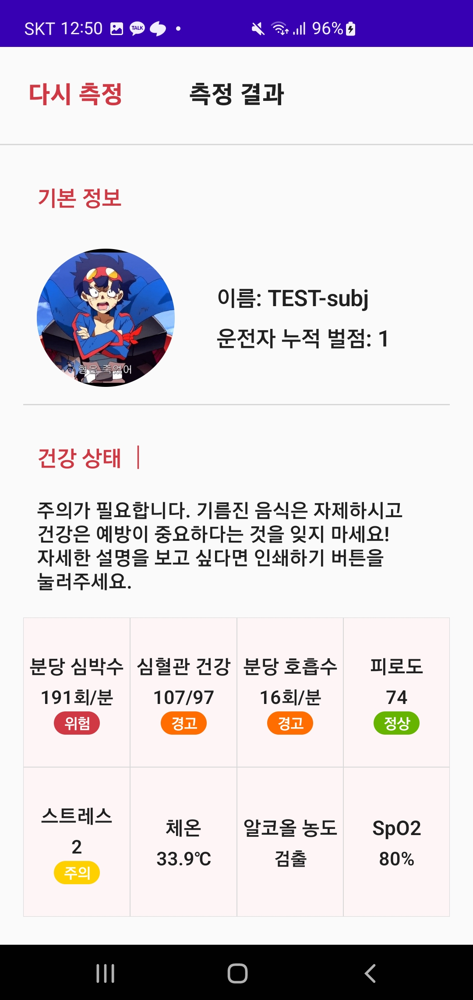

# DeepMedi_Work
딥메디 개발 과제입니다.

<br>

## 프로젝트 구조
**MVVM, Clean Architecture**로 설계했습니다.

```
 ┌─ common
 │     └─ Constants.kt
 │
 ├─ data
 │     ├─ mapper
 │     ├─ remote
 │     │    ├─ api
 │     │    └─ dto
 │     └─ repository
 │          ├─ upload
 │          └─ user_info
 │     
 ├─ domain
 │     └─ remote
 │          ├─ model
 │          │    ├─ upload
 │          │    └─ user_info
 │          └─ repository
 │               ├─ upload
 │               └─ user_info
 │                
 ├─ presentation
 │     ├─ di
 │     ├─ navigation
 │     ├─ view
 │     │   ├─ main
 │     │   └─ result
 │     └─ viewmodel
 │
 ├─ navigation
 │     └─ NavScreen.kt
 │
 ├─ MainActivity.kt
 └─ DeepMediApplication.kt
 
```  

## 기능

### **메인 화면**


중앙에 카메라 화면을 배치했고, 하단엔 촬영 버튼이 존재합니다. 촬영 버튼을 누르면 이미지 파일이 생성되고, 해당 파일은 서버에 전송됩니다.

<br>

### **이미지 파일 전송 완료**


이미지 파일이 정상적으로 전송되었다면 위와 같은 화면으로 이미지 전송이 완료되었다는 것을 알려줍니다.

<br>

### **사용자 건강 정보 화면**


서버에서 받아온 데이터를 통해 사용자 사진과 이름, 음주운전 이력, 건강정보 상태를 표시합니다.

<br>


## Use Skills
* Jetpack Compose
* MVVM Pattern
* Clean Architecture
* Coroutine
* Hilt  
* Gson  
* Retrofit  
* Coil  
* Permission  
* CameraX  
